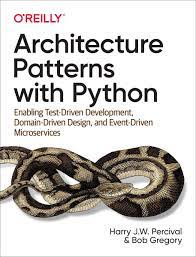

= When To Refactor Into Generators And How
:author:    Jan-Hein Bührman
:email:     jan-hein.buhrman@ordina.nl
:backend:   slidy
:stem:
:max-width: 47em
:data-uri:
:icons:

// This is a comment

// .Contents
// [role="incremental"]
// * Learning objectives
// * A basic PyTest fixture
// * Context Switch: _generator functions_ session
// * _iterator protocol_ session
// * Using fixtures to clean up stuff after test execution in PyTest
// * Example (if time permits): temporarily manipulate environment
// * Concluding remarks
// * Recap

== Goals
[role="incremental"]
After this presentation, you will: ...

[role="incremental"]
* be able to _recognize_ certain loop constructs as candidate for refactoring,

* know _how_ to convert these constructs into more maintainable _Pythonic_ code,
+
by refactoring them into an elegant pipeline of
 generators.

* be more acquainted with the standard library `itertools` module and the `more-itertools` package

== Topics
[role="incremental"]
* A first example: loops with similar code but with different start/stop/selection criteria
* What is refactoring
* Short intro on a Generator function
* How to recognize some "patterns" of loop constructs as refactoring candidates
* FIXME: what else?

== A first example -- loops with similar code
[role="incremental"]
* Suppose your Product Owner requires a function that returns a list of all Fibonacci number less than n
* Who knows what a Fibonacci number is? ✋

[role="incremental"]
--
[quote, Wikipedia, Fibonacci Number]
____________________________________________________________________
In mathematics, the **Fibonacci numbers** [...] form a sequence, the **Fibonacci sequence**, in which each number is the sum of the two preceding ones. The sequence commonly starts from 0 and 1, [...]

Starting from 0 and 1, the next few values in the sequence are:

{empty}:: 0, 1, 1, 2, 3, 5, 8, 13, 21, 34, 55, 89, 144, ...
____________________________________________________________________
--

== Specify the test first (Test-Driven)
[role="incremental"]
* Let's specify the test first so that we exactly know what we need to develop
* And let's use the _Gherkin Language_ to specify this:

[role="incremental"]
[source,feature]
----
Feature: Fibonacci functionality FIXME will become Fibonacci all the way later on
  As a curious person,
  I want to see the a list of the Fibonacci numbers less than a certain
    value,
  So that I can learn how they look like.

  Scenario: List of Fibonacci numbers less than N
    Given a module providing Fibonacci related functionality
    When I call the "fib_list_to" function with parameter "10"
    Then the function returns a list of "0, 1, 1, 2, 3, 5, 8"
----

[role="incremental"]
* It is a convention to put in-line parameters (like `"10"`) between double quotes

[role="incremental"]
[horizontal]
**Given**:: Describes a stable, intial state of the system _before_ the relevant action is taken
**When**:: Describes the _action_ that is relevant for this specific scenario
**Then**:: Describes the _outcome_ of the action

[role="incremental"]
(credits & more info: https://automationpanda.com/2017/01/26/bdd-101-the-gherkin-language/[Automation Panda])

== Implementation
[role="incremental"]
[source,python]
----
def fib_list_to(n):
    """Return list of all Fibonacci numbers less than n."""
    result = []
    a, b = 0, 1
    while a < n:
        result.append(a)
        a, b = b, a + b
    return result
----
[role="incremental"]
* Source: https://docs.python.org/3/tutorial/modules.html
* ❓ Add type annotions ❓

== Implementation (with type annotations)
[source,python]
----
def fib_list_to(n: int) -> list[int]:
    """Return list of all Fibonacci numbers less than n."""
    result: list[int] = []
    a, b = 0, 1
    while a < n:
        result.append(a)
        a, b = b, a + b
    return result
----

//== Test
//[role="incremental"]
//[horizontal]
//CPU:: Central Processing Unit
//Hard drive:: lkjldf
//RAM:: Yep I know

What Is Behavior Driven Development
-----------------------------------
[role="incremental"]
* Centered around _feature behavior_ specifications
** These are _concrete, realistic examples_ to create a shared understanding of how the system
   (application) should behave
** Defined as a scenario of _inputs_, _actions_, and _outcomes_
** There are usually written in a special language, called _Gherkin_
*** *Given* ... *When* ... *Then* ...
* The Features / Scenarios can be extended into _executable_ tests, with relative ease
* Embraces Test Driven Development (TDD) techniques and principles
** Because the specifications are automatically _verifiable_
* Goes well together with Domain Driven Design (DDD)
** Because the scenarios are written in a non-technical language, using real world
   (business) terminology

What Are the Benefits of Behavior Driven Development
----------------------------------------------------
[role="incremental"]
* _Concrete_ examples result in _unambiguous_ specification
* A single common language between _Users_ & _Product Owner_, _Developers_, and _Testers_, and
  possibly other non-technical stakeholders
* It encompasses:
** Requirements
** Acceptance Criteria
** Test Cases

The Gherkin Language
--------------------

✋ Who is familiar with Gherkin?

Gherkin: Standard Example
-------------------------
[role="incremental"]
[source,feature]
----
Feature: Google Searching

  Scenario: Simple Google search
    Given the Google home page is displayed
    When the user enters "panda" into the search bar
    Then links related to "panda" are shown on the results page
----

[role="incremental"]
* It is a convention to put in-line parameters (like `"panda"`) between double quotes

[role="incremental"]
[horizontal]
Given:: Describes a stable, intial state of the system _before_ the relevant action is taken
When:: Describes the _action_ that is relevant for this specific scenario
Then:: Describes the _outcome_ of the action

(credits: https://automationpanda.com/2017/01/26/bdd-101-the-gherkin-language/[Automation Panda])

Gherkin Feature: Additional Steps
----------------------------------
[role="incremental"]
* Using "And" and "But" to specify additional steps of the same kind as the previous one
+
[source,feature]
----
Feature: Google Searching
  As a web surfer,
  I want to search Google,
  so that I can learn new things.

  Scenario: Simple Google search
    Given a web browser is on the Google page
    When the search phrase "panda" is entered
    Then results for "panda" are shown
    And the related results include "Panda Express"
    But the related results do not include "pandemonium"
----

(credits: https://automationpanda.com/2017/01/27/bdd-101-gherkin-by-example/[Automation Panda])

Gherkin Features: Doc Strings, Step Tables
------------------------------------------
[source,feature]
----
Feature: Showcase entering large(r) text blobs and tables
  As a ...
  I want to ...
  So that ...

  Scenario: Behave can manage blobs of text
    Given the following blob of text
      """
      This is line 1
      This is line 2
      This is line 3
      """
    When the developer splits that text into its lines
    Then the lines should look like
      | line           |
      | This is line 1 |
      | This is line 2 |
      | This is line 3 |
----
[CAUTION]
This is a bit of a contrived example, because this example has not been put in the language of
the business domain.

[TIP]
Doc String and Step Tables can be used in any step ("Given", "When", or "Then")

Gherkin: Background
-------------------
[source,feature]
----
Feature: Some additional behave examples

  Background: You can share the initial given steps for multiple scenarios
    Given the following blob of text
      """
      This is line 1
      This is line 2
      This is line 3
      """

  Scenario: We can select a line from a blob of text
    When the developer selects a line with index "1" (counting from zero)
    Then the line should be "This is line 2"

  Scenario: We can count the number of lines in a text
    When the developer counts the number of lines
    Then the count should be "3"
----

[NOTE]
The _Background_ steps are repeated for every _Scenario_

[CAUTION]
Don't abuse _Background_ for a series of complicated "Given"
steps, for example to initialize the database, or setup the API.
That part should be solved with "environment" fixtures.

Gherkin Feature: Scenario Outline
----------------------------------
[role="incremental"]
* Using `Scenario Outline:` to repeat the tests with different sets of parameters
+
[source,feature]
----
Feature: Google Searching

  Scenario Outline: Simple Google searches
    Given a web browser is on the Google page
    When the search phrase "<phrase>" is entered
    Then results for "<phrase>" are shown
    And the related results include "<related>"

    Examples: Animals
      | phrase   | related       |
      | panda    | Panda Express |
      | elephant | Elephant Man  |
----

(credits: https://automationpanda.com/2017/01/27/bdd-101-gherkin-by-example/[Automation Panda])

[role="incremental"]
[NOTE]
You can compare this with `pytest.mark.parametrize` or `unittest.TestCase.subTest()`

[role="incremental"]
[TIP]
Do not confuse this _Scenario Outline_ feature with the _Step Tables_ feature, shown earlier

Making Your Gherkin Executable
------------------------------
* Step definitions glues the Gherkin specification to the Python code
* PyCharm can generate skeleton code for you

.Example step
[source,feature]
----
    Given the following blob of text
      """
      This is line 1
      This is line 2
      This is line 3
      """
----

.Corresponding step code
[source,python]
----
@given("the following blob of text")
def step_impl(context: runner.Context) -> None:
    # `context.text` contains the blob of text
    context.saved_text = context.text
----

Making Your Gherkin Executable (2)
----------------------------------
.Example step
[source,feature]
----
    When the developer splits that text into its lines
----

.Corresponding step code
[source,python]
----
@when("the developer splits that text into its lines")
def step_impl(context: runner.Context) -> None:
    # Add some typing, and fetch data from context
    saved_text: str = context.saved_text
    context.split_lines = saved_text.splitlines()
----

.Another *When* step (from another scenario)
[source,feature]
----
    When the developer selects a line with index "1" (counting from zero)
----

.Corresponding step code
[source,python]
----
@when('the developer selects a line with index "{index:d}" (counting from zero)')
def step_impl(context: runner.Context, index: int) -> None:
    # Note the `:d` format. `behave` uses the `parse` package by default
    #  for argument matching (sort of inverse of `str.format()`)
    # But `:s` is *not* `str`; simply don't use a specifier for strings.
    context.selected_line = context.saved_text.splitlines()[index]
----

Making Your Gherkin Executable (3)
----------------------------------
.Example step (Step Tables)
[source,feature]
----
    Then the lines should look like
      | line           |
      | This is line 1 |
      | This is line 2 |
      | This is line 3 |
----

.Corresponding step code
[source,python]
----
@then("the lines should look like")
def step_impl(context: runner.Context) -> None:
    # context.table.headings contains the table headings
    #   context.table.rows is a list of row elements
    #   you can also obtain these by iterating over just context.table
    # Note that you can also select an element from a table row by column name
    # Below you see PyHamcrest in action (`assert_that()`, `contains_exactly()`)
    # CAVEAT: the expected sequence in `contains_exactly()` is given as distinct arguments
    assert_that(
        context.split_lines, contains_exactly(*(row["line"] for row in context.table))
    )
----

Making Your Gherkin Executable (4)
----------------------------------
.Example step (plain parameter)
[source,feature]
----
    Then the line should be "This is line 2"
----

.Corresponding step code
[source,python]
----
@then('the line should be "{line}"')
def step_impl(context: runner.Context, line: str) -> None:
    # PyHamcrest again: (`assert_that()`, `is_()`, `equal_to()`)
    assert_that(context.selected_line, is_(equal_to(line)))
----

.Example step (plain integer parameter)
[source,feature]
----
    Then the count should be "3"
----

.Corresponding step code
[source,python]
----
@then('the count should be "{line_count:d}"')
def step_impl(context: runner.Context, line_count: int) -> None:
    assert_that(context.line_count, is_(equal_to(line_count)))
----

Hands-On❗️
---------
The previous example in action

Hands-On❗️
---------
We're using the example of the Cosmic Python book: 

* A furniture shop that decides to implement a new way of allocating stock
* The new functionality allows for allocating stock while it's still underway (shipment)
* _Too much domain knowledge_:
** *A _SKU_ (Stock Keeping Unit) identifies a _product_*
** _Customers_ place _orders_, with an _order reference_
** *An order contains multiple _order lines_*
** An order line contains a SKU and a _quantity_
** *The _purchasing department_ orders small _batches_ of stock*
** A batch of stock has a _reference_, a _SKU_ and a _quantity_
** *We want to _allocate_ _order lines_ to _batches_*
** A batch has an _ETA_ if it's currently shipping, and if not, it is in _warehouse stock_
** The order of preference when allocating a batch, is
*** the batch that is in _warehouse stock_, if that's the case
*** the batch that is currently shipping, with a preference to the earliest ETA
** When the batch is in warehouse stock, or otherwise when the batch arrives,
*** the stock determined by the _order line_ is taken from the allocated to batch, and
*** is sent to the _customer_
** When you allocate _x_ units of stock to a batch, the _available quantity_ is reduced by _x_
** You can't allocate to a batch if the available quantity is less than the quantity of the order
   line
** You can't allocate the same order line twice to the same batch

Some loose ends
---------------
* `dotted.DottedDict` and `dotted.DottedList` for sparse-testing (nested) structures
* Using BDD
** For unit tests
** Using it only for slow (Selenium) UI tests
* Use 3^rd^ person in your Gherkin
* Use present tense
* _One Scenario_, _One Behaviour_
** No series of steps - checks - steps - checks
* `pytest-bdd` as an alternative

Resources and Links
-------------------

Automation Panda::
    https://automationpanda.com/bdd/
    +
    https://automationpanda.com/2017/01/26/bdd-101-the-gherkin-language/
Wikipedia::
    https://en.wikipedia.org/wiki/Behavior-driven_development
Behave docs::
    https://behave.readthedocs.io/
PyHamcrest docs::
    https://pyhamcrest.readthedocs.io/
`dotted`::
    https://pypi.org/project/dotted/
Cosmic Python::
    https://www.cosmicpython.com/

Recap
-----
You've heard about the following:
[role="incremental"]
* What is Behavior Driven Development
** How it relates to Test Driven Development
** How it relates to Domain Driven Design
* How does the Gherkin language looks like
** Including various constructs within the language
* How to use `behave` as BDD tool for Python
** How to create step definitions (making the specs executable)
** How to run it
** How to select (groups of) tests
** How to use setup- and teardown-fixtures
* How to test different interfaces of your system with the same tests (slow vs fast)
** By using the `--stage` option
* Additional packages to make validating easier
** PyHamcrest for more expressive validation and better diagnostics
** `dotted.DottedDict` and `dotted.DottedList` for complex data validation (needed? desired?)
* Some pieces of advice when specifying Gherkin
** Think twice about using BDD for unit tests
** Think twice about only using BDD for slow (Selenium-based) ui tests
** Don't use Gherkin to do complex technical system setup
** Use 3^rd^ person
** Use present tense
** _one scenario_, _one behavior_
* Alternative(s) for `behave`
* Additional resources

Thank You
---------

Jan-Hein Bührman

FIXME some twitter and email handles here, I guess, perhaps a link to the presentation (QR code?)

Slides created with AsciiDoc using the "slidy" back end (https://asciidoc-py.github.io/slidy.html)

Questions
---------
.Questions
****
❓
****
